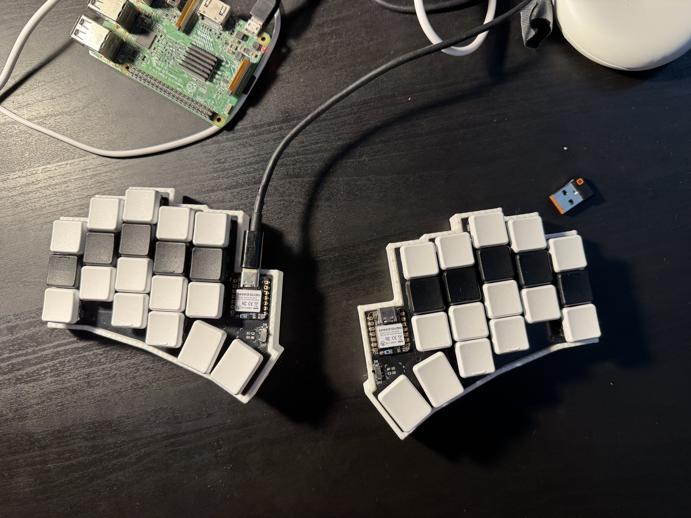
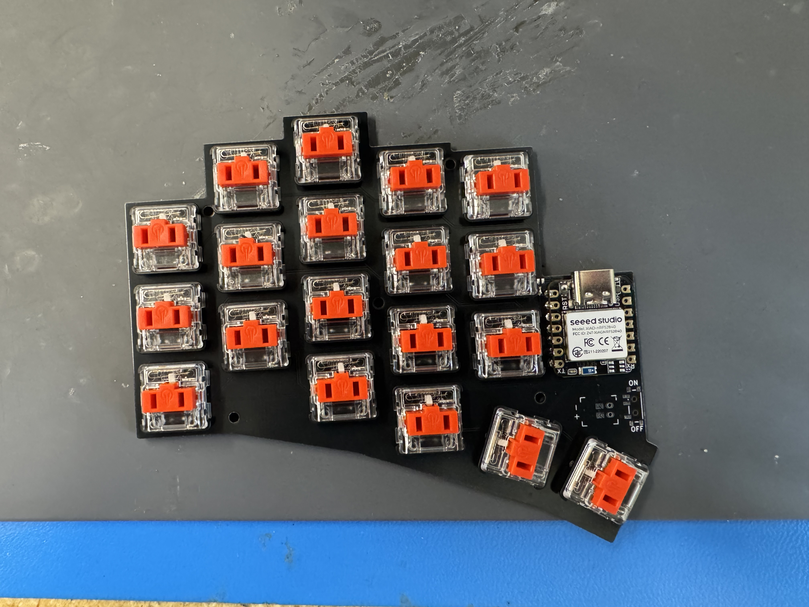
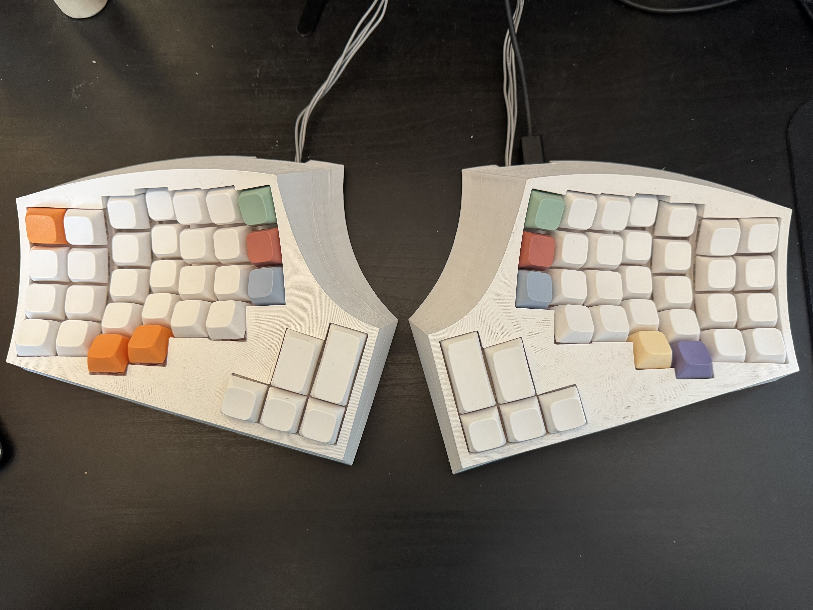
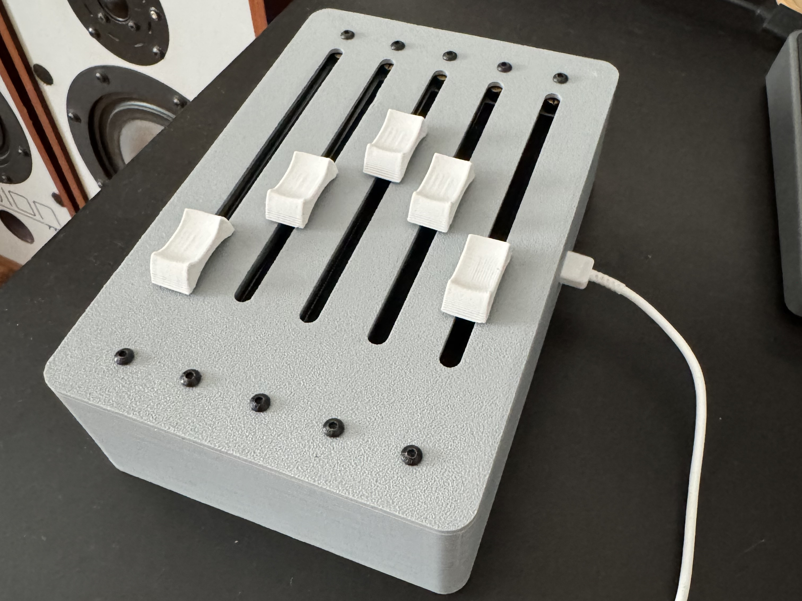
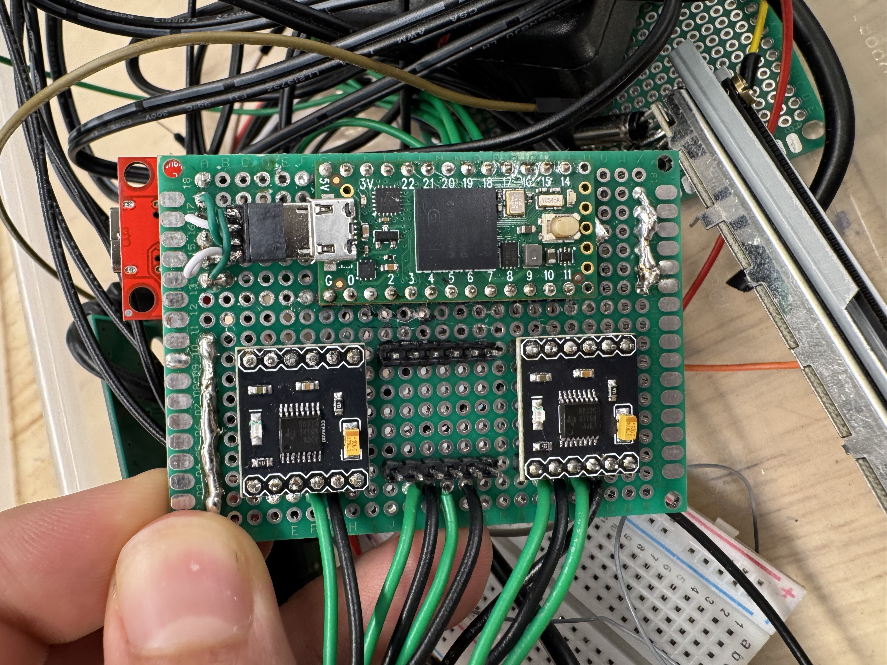
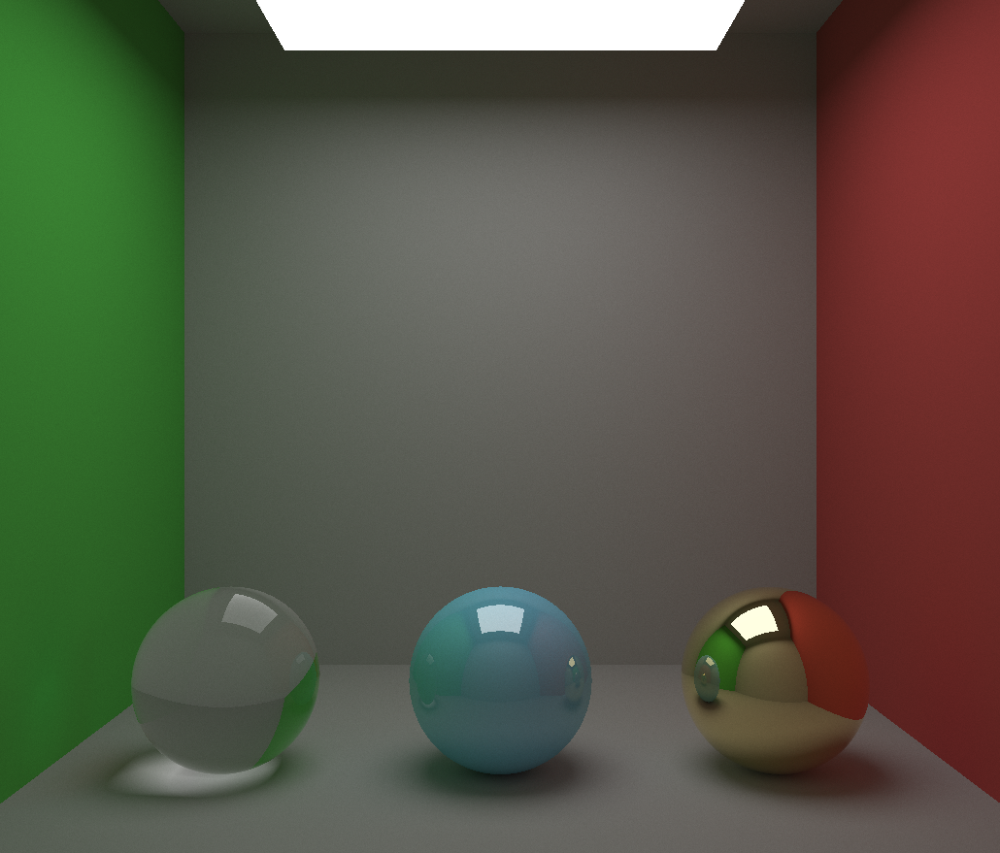

# Ilya McCune-Pedit


```sh
ffmpeg -i input.mov \
  -c:v libx264 \
  -preset slow \
  -crf 20 \
  -pix_fmt yuv420p \
  -movflags +faststart \
  -an \
  portfolio.mp4
```

## Keyboards

I engineered and manufactured a custom split keyboard system designed to
optimize typing ergonomics by minimizing finger travel and reducing
strain. Utilizing KiCad, I designed and routed a PCB that would work as
both a left hand and right hand keyboard. Later realized the downsides
of small keyboards when it came to doing anything other than writing
prose and designed a larger 76 key concave keyboard where even thought
fingers needed to move more the keys were positioned so I didn't have to
reach as far.

::: center
{width="29.8%"}
{width="29.8%"}
{width="29.8%"}

{width="45%"}
{width="45%"}
:::

## Motorized MIDI Faders

My brother wanted extra faders for his midi keyboard and laptop. I
ordered replacement Behringer faders and wired up their potentiometers
and motors to a Teensy 4.0 microcontroller and drv8833 motor
contorllers. The sliders can be moved by hand and send MIDI control
commands over usbc to a connected computer. If a value on the computer
is changed it sends that to the microcontroller which then moves the
fader using closed loop control.\
Video of it in action:
<https://drive.google.com/file/d/1cmTr2MTMlvmQlSNUoPL0QjaPzFTNswW_>

::: center
{width="45%"}
{width="45%"}
:::

## Software Pathtracer

::: minipage
Created a software graphics engine in C++, that simulated rays of light
bouncing off spheres and planes to create images based off of the book
*Ray Tracing in One Weekend*. All models are defined mathematically and
materials determine how a light ray interacts with the surface once an
intersection has been determined. Created 3 base materials,
glass/translucent, metallic/glossy, and a generic diffuse material.

Full code can be seen here, though it was left in the middle of
experimenting with other graphics apis.\
<https://github.com/imccunepedit/RyeTracer>
:::

::: minipage
{width="\\linewidth"}
:::

## Plasma Tube Notcher

I served as the Electrical Design Lead for a team of six design to
develop a functional, small-scale CNC plasma tube notcher. I was
responsible for selecting and integrating stepper motors, configuring
drivers, and relay logic to control the plasma cutter.\
Video of the machine in action:

<https://drive.google.com/file/d/1SC6PNp-PzONvo7yJ9i7iKf-WtKjfxmGF>
